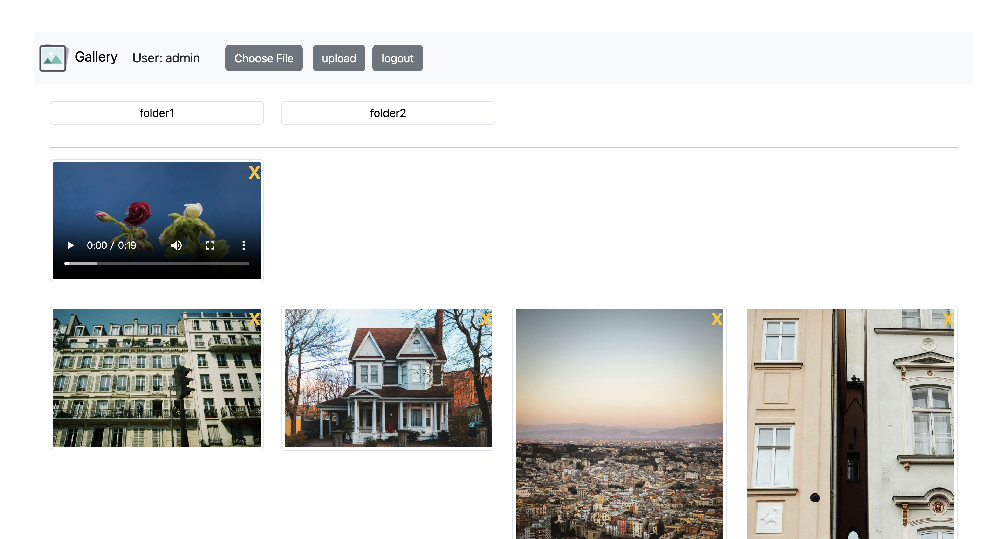
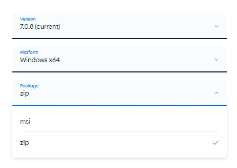
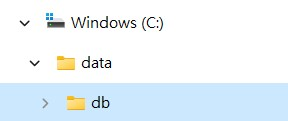
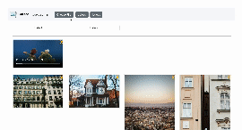
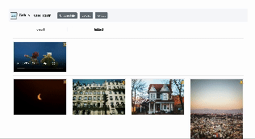
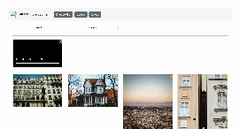
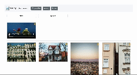
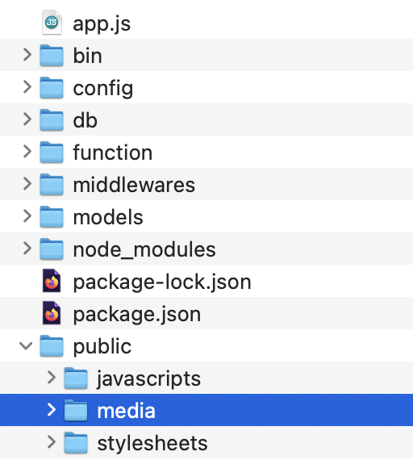

Using the Node.js Express framework to build an online gallery, combined with MongoDB to control system access.

# Usage:
## 1. Download NodeJS  
   click this link to download NodeJS, https://nodejs.org/en/download  
   
   ### For MacOS:  
   After installation, you should be able to run node and npm in terminal.  
   To check if the installation success, run ```node -v``` and ```npm -v``` to see version of node and npm.  
   
   ### For Windows:  
   After installation, open Node.js command prompt to enter script  
   To check if the installation success, run ```node -v``` and ```npm -v``` to see version of node and npm.
   
## 2. Install MongoDB Community Server
   click this link to download MongoDB Community Server, https://www.mongodb.com/try/download/community

   ### For MacOS: 
   * After download and unzip the tgz package, you need to move the package to home directory by running ```mv PACKAGE_NAME /Users/YourUserName/```.
   * Next, cd to home directory and run ```ls -al``` to find **.zshrc**, a configuration file used for setting up and customizing the user environment.  
   * Run ```open .zshrc``` to open **.zshrc** and set environment variable by adding ```export PATH=${PATH}:/Users/YourUserName/PACKAGE_NAME/bin```.
For my example, the environment variable will be ```export PATH=${PATH}:/Users/jeremyhsieh/mongodb-macos-aarch64-7.0.8/bin```
   * After save the modified **.zshrc**, run ```source .zshrc``` to update environment variable.
   * Finally, create folder **YOUR_HOME_DIRECTORY/data/db/**, this is the default path of MongoDB for data storage, you can check your home directory by opening a new terminal and running ```pwd```.
  


     To check if you successfully install MongoDB, run ```mongod --version``` in terminal to see the version of MongoDB.  
     If you wish to use mongosh in terminal, click this link to download MongoDB Shell https://www.mongodb.com/try/download/shell and do the same steps as how you install MongoDB.  
   
   ### For Windows:  
   > Here are two types of packages you could download for MongoDB: MSI and ZIP.  
   > Either MSI or ZIP is available, the difference between these two type is that MSI will directly install package under **C:\Program Files\MongoDB\\**. On the contrary, you will need to manually unzip and move the package to your destinated path if you choose ZIP.  

  


   * Create folder **C:\data\db\\**, this is the default path of MongoDB for data storage.  

  

   * After installation, cd to the bin folder of MongoDB package, for exmaple of choosing MSI, the path will be **C:\Program Files\MongoDB\server\YOUR_VERSION\bin** and then you can run ```mongod``` to activate MongoDB.  
     
## 3. Download Repo  
   > For MacOS: open a new terminal to do follow steps.    
   > For Windows: open a new Node.js command prompt to do follow steps.  

   * To run a nodeJS project, you need to download, unzip, and cd into the Repo.
   * Run ```npm install``` to install packages according to **package.json** for the project.
   * Run ```npm install -g nodemon``` to install nodemon globally, this package allows you to modifiy code without restart the preject.  

## 4. Activate Project
   Now you've completed all requirements, let's activate the online gallery!  

   ### For MacOS:  
   * Open a new terminal and run ```sudo mongod --dbpath=YOUR_HOME_DIRECTORY``` to activate MongoDB, the default DB path this **YOUR_HOME_DIRECTORY/data/db/**.  
   * Open another terminal and run ```npm start``` to activate project.  

   ### For Windows:  
   * Open a new cmd, cd to the bin folder of MongoDB package and run ```mongod``` to activate MongoDB.  
   * Open a new Node.js command prompt and run ```npm start``` to activate project.

   Now, click http://127.0.0.1:3000/1222/, you can interact with the gallery.

## 5. Register and Log-in
   When you click http://127.0.0.1:3000/1222/, you will reach the log-in page. However, because you don't have an account yet, you can't log-in.  
   What you have to do is go to http://127.0.0.1:3000/register/ to sign-up a new account, after that you will be redirected to the log-in page and then you can log-in to the gallery.  
   
## 6. Gallery Introduction  
   ### Supported File type
   The gallery accept four types of pictures and two types of video:  
   > picture    
   * jpg  
   * jpeg  
   * png  
   * heic
       
   **Please note that if you upload a **heic** file, the system will convert it to a **jpeg** file and delete the origin file.  
   Since the browsers do not support this file type due to licensing agreements.**  

   > video  
   * mov  
   * mp4  

   **Please note that All media upload to the gellery will be rename with its timestamp**  


   ### Upload  
   * Click _choose file_  
   * Select media  
   * Click _upload_

     

   ### Delete  
   * Click _X_ on the right-top of the media   
   * Comfirm the alarm
     
     

   ### Switch Pictures  
   * Click picture to zoom-in picture  
   * Click the left/right part of the zoomed-in picture to switch to the previous/next picture  
   * Click the shadow to zoom-out  
  
   

   ### Play Video  
     

   ### Logout  
     

## 7. The other way to modify media

   When you try to upload massive files or a big files through gallery upload function, the system might crash.  
   Here provides an alternative way to add media.  
   This gallery is developed using the Express framework, we use express-generator to build framework automatically.  

   All media save in the **media** folder, you can add, delete and rename files, even create a new folder in the **media** folder.  
     

   


